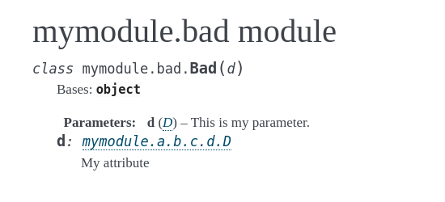
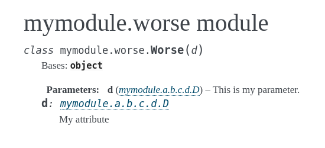
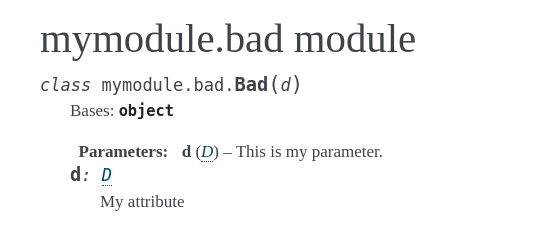
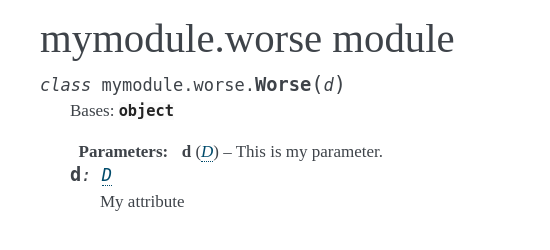

# Sphinx typehint attribute bug

With the short typehint format:

    autodoc_typehints_format = 'short'

when a class attribute has type annotation, the long, qualified name is used instead of the short one.

## 1. Without `napoleon`

    cd sphinx_typehint_attribute_bug/doc
    make clean && make

See screenshot:

Only the attribute type is qualified, the parameter type is not.

## 2. With `napoleon`

    cd sphinx_typehint_attribute_bug_napoleon/doc
    make clean && make

See screenshot:

Now both the attribute and the parameter types are qualified.

## After patching

After applying [this patch](patch.diff):

